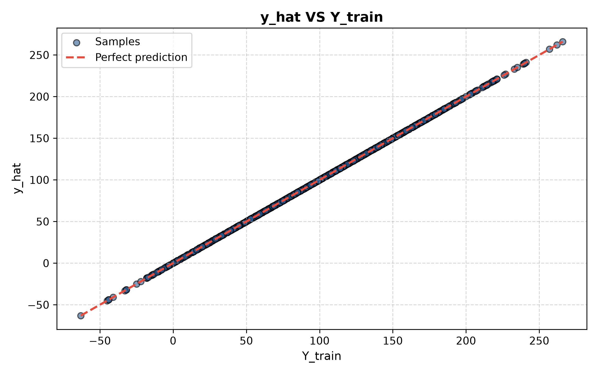

# RawLinearRegression

A **linear regression model built from scratch in Python**. This is a learning project focused on understanding how linear regression works internally rather than using a machine learning library.

## What it does

The model implements **n-feature linear regression**, where each sample is a list of `n` features:

```text
ŷ = W₁X₁ + W₂X₂ + ... + WₙXₙ + b
```

Training data (`X_train`) is a list of samples, where each sample is itself a list of feature values:

```text
X_train = [
    [x11, x12, x13, ...],  # sample 1
    [x21, x22, x23, ...],  # sample 2
    [x31, x32, x33, ...],  # sample 3
    ...
]
```

`Y_train` remains a flat list of target values.

Training is done manually using **batch gradient descent** and **Mean Squared Error (MSE)**. For a general feature `Xᵢ`, the gradients are:

```text
∂MSE/∂Wᵢ = (2/n) Σ(ŷ - y)Xᵢ
∂MSE/∂b  = (2/n) Σ(ŷ - y)
```

Each training step follows the pipeline: **generate `ŷ` → compute gradients → update weights and bias → repeat**.

The model itself (`model.py`) is written in **pure Python**, with no NumPy involved — weights, predictions, and gradients are all plain Python lists and loops. NumPy is currently only used in `dataset.py` to generate random training data.

Weights start at `0` and the bias starts at `0.0`. The learning rate defaults to a very small value (`1e-7`), since larger values tend to make the model diverge ("explode") during training.

## Current Experiment

The model is currently being trained on a 4-feature relationship:

```text
Y = X1 + X2 - X3 + X4
```

Features are randomly generated integers (0–100 by default). For this relationship, the ideal parameters are:

```text
W1 ≈ 1
W2 ≈ 1
W3 ≈ -1
W4 ≈ 1
b  ≈ 0
```

The goal is to watch the model discover these values through gradient descent. Accuracy is measured as the percentage of test predictions that land within a small tolerance (default `0.01`) of the true value.

## Results

After training, `graphic.py` can be used to plot predicted values (`y_hat`) against the true values, with a dashed red line marking a perfect prediction:



The tight clustering along the diagonal shows the model converging closely to the true `Y = X1 + X2 - X3 + X4` relationship.

## Project Structure

```text
RawLinearRegression/
├── model.py      # Core model: prediction, gradients, training loop, accuracy, stats
├── dataset.py     # Generates synthetic training/test data
├── graphic.py     # Optional: plots predicted vs. true values with matplotlib
├── main.py        # Entry point: trains the model and reports results
└── README.md
```

## Status

**Work in progress**

This is a learning project. The focus is on understanding the mathematics and mechanics of linear regression from the ground up.

## Requirements

* Python 3
* NumPy (used in `dataset.py` for data generation)
* Matplotlib (used in `graphic.py` for optional result visualization)
